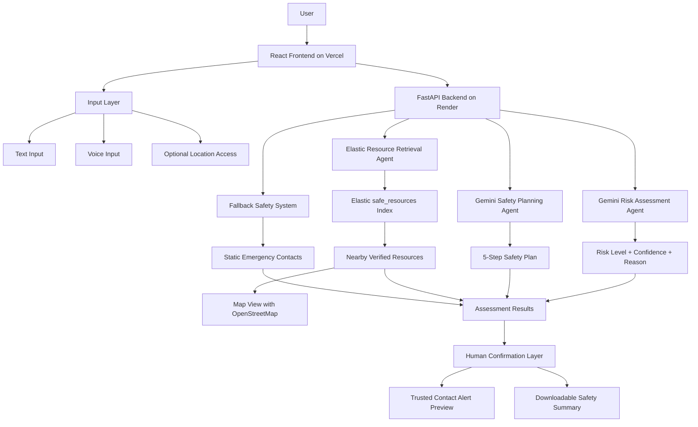

# SafePath AI

SafePath AI is a privacy-first AI safety decision-support platform designed to help users assess potentially dangerous situations, discover nearby verified safety resources, and generate immediate action plans in real time.

The platform combines Gemini reasoning, Elastic retrieval, geolocation, voice input, and interactive maps to create a multi-stage agentic safety workflow.

---

## Features

- AI-powered real-time risk assessment
- Structured 5-step emergency safety planning
- Voice-to-text distress input
- Live browser geolocation support
- Reverse geocoding for readable locations
- Nearby verified safety resource retrieval
- Interactive OpenStreetMap visualization
- Trusted-contact alert preparation
- Downloadable safety summaries
- Human-in-the-loop confirmation workflow
- Fallback emergency response system

---

## Architecture



SafePath AI uses a multi-stage agentic workflow combining Gemini reasoning, Elastic retrieval, geolocation, voice input, and human-in-the-loop confirmation to provide privacy-first safety guidance.

---

## Tech Stack

### Frontend
- React
- React Leaflet
- OpenStreetMap
- Vercel Deployment

### Backend
- FastAPI
- Gemini 2.5 Flash
- Elastic Cloud
- Render Deployment

---

## Run Frontend

```bash
cd frontend
npm install
npm start
```

---

## Run Backend

```bash
cd backend
pip install -r requirements.txt
uvicorn main:app --reload
```

---

## Environment Variables

### Backend

```env
GEMINI_API_KEY=your_key
ELASTIC_ENDPOINT=your_endpoint
ELASTIC_API_KEY=your_api_key
```

### Frontend

```env
REACT_APP_API_URL=http://127.0.0.1:8000
```

---

## Deployment

Frontend:
- Vercel

Backend:
- Render

Search Infrastructure:
- Elastic Cloud

---

## Future Improvements

- Real-time emergency routing
- SMS trusted-contact escalation
- Multi-language voice support
- Safer route navigation
- Expanded verified safety datasets
- Mobile application support